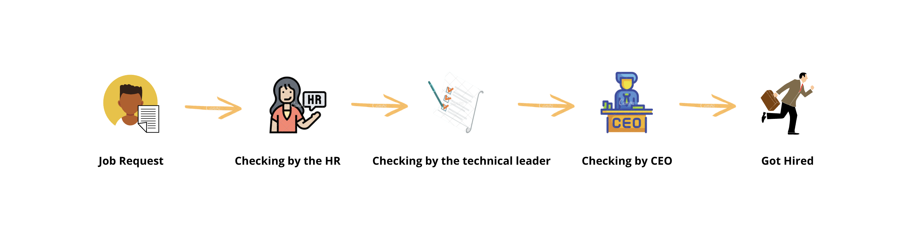

# Chain of responsibility: A chain of objects

It helps to build a chain of objects. A request enters from one end and keeps going from an object to another until it finds a suitable handler.

Wikipedia Says
-------
In object-oriented design, the chain-of-responsibility pattern is a design pattern consisting of a source of command objects and a series of processing objects. Each processing object contains logic that defines the types of command objects that it can handle; the rest are passed to the next processing object in the chain.

How it works
------
Chain of responsibility means handling a request by a chain of handlers. The handlers in the chain can act two types of action
1- Could assign the request to the next handler in the chain when it didn't execute by the handler.
2- Can drop the request and avoid assign it to the next handler in the chain when it's not accepted by the handler.

To make it simple understandable for you I will explain two different scenarios:

1- Imagine you created a Logger which has three handlers (debug, info, error). 
Then to log a message, You will choose the type of your message and send it. The message(request) will walk in the chain to do by a handler.
it will move between the handlers sequentially until one handler in the chain accepts that and do it.

2- Imagine you sent a job request to a company, Your request should accept by the human resource, Then it should accept by the technical leader, Then CEO should accept it. and after, You are an employee of the company. If any of these three units did not accept your job request. Your request will drop and will not send to the next chain.

⬇️ Let me describe with an example
------

Let's build a job request chain, You sent a job request to a company, Your request should accept by the human resource, Then it should accept by the technical leader, Then CEO should accept it. and after, You are an employee of the company. If any of these three units did not accept your job request. Your request will drop and will not send to the next chain.
 
 Intent
 ------
 Avoid coupling the sender of a request to its receiver by giving more than one object a chance to handle the request. chain the receiving objects and pass the request along the chain until an object handles it.
 
 Projects using chain of responsibility
 ------
 - java.util.loggin.Logger#log()
 - Apache Common Chain
 - javax.servlet.Filter#doFilter()
 
 Applicability
 ------
 1- More than one object may handle a request, and the handler isn't known a priori. The handler should be as certained automatically.  
 2- You want to issue a request to one of several objects without specifying the receiver explicitly.  
 3- The set of objects that can handle a request should be specified dynamically.
 
 Alternative Design Patterns
 ------
 - Command
 - Mediator
 - Observer
 - Pipeline
 
 Source
 ------
  - [Kudvenkat youtube tutorial](https://www.youtube.com/watch?v=rI4kdGLaUiQ&list=PL6n9fhu94yhUbctIoxoVTrklN3LMwTCmd)
  - [Derek Banas youtube tutorial](https://www.youtube.com/watch?v=vNHpsC5ng_E&list=PLF206E906175C7E07)
  - [Java-design-patterns.com](https://java-design-patterns.com/patterns/chain/)
  - [Refactoring.guru](https://refactoring.guru/design-patterns/chain-of-responsibility)
  
  Sponsor
  -------
  ### If you like and use it, please tap the Star(⭐️) button at the above.  
  This source code is free for all; hence, it's not profitable. You can make me happy by donating me :)
  
  
  
  
  
  
  License
  -------
  Copyright (C) 2021 Mehdi Janbarari  
  The source code can be used according to the [Apache License, Version 2.0](LICENSE).